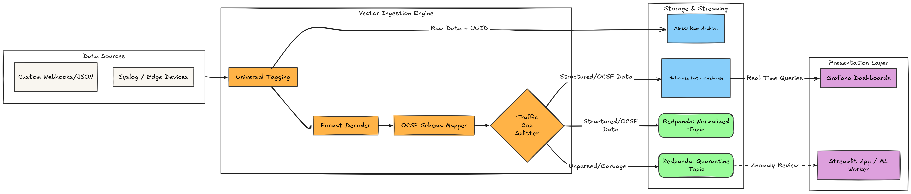

# Unified Logging & Processing Framework (ULPF)

> **Smart India Hackathon (SIH) Submission**  
> An enterprise-grade, high-throughput cybersecurity data pipeline engineered for real-time log ingestion, OCSF schema normalization, and compressed Parquet columnar storage.

---

## 📌 Executive Summary & Problem Statement

Modern Security Operations Centers (SOCs) contend with vast amounts of fragmented log data from firewalls, servers, cloud workloads, and endpoints. Ingesting and querying these disparate logs leads to exorbitant storage costs, vendor lock-in, and delayed threat response times.

**ULPF (Unified Logging & Processing Framework)** addresses these core challenges through an open, modular pipeline that:
1. **Standardizes** multi-source raw logs into the **Open Cybersecurity Schema Framework (OCSF)** standard in real time using Vector.
2. **Transforms** normalized JSON streams into compressed **Apache Parquet** columnar files via a high-performance **Rust worker** (`ulpf-parquet-worker`).
3. **Reduces** storage footprints by up to 80% while enabling sub-second analytical querying.
4. **Monitors** pipeline health and schema remapping interactively through a **Streamlit** control panel.

---

## 🏗️ System Architecture



---

## ✨ Key Technical Innovations

* **Unified OCSF Standard**: Enforces a vendor-agnostic cross-platform event taxonomy, making log streams SIEM-ready without lock-in.
* **Rust-Powered Pipeline Engine**: Built with Rust for zero-GC memory safety, maximum CPU concurrency, and minimal memory overhead under heavy log throughput.
* **Columnar Parquet Compression**: Replaces raw text storage with Snappy/ZSTD-compressed Parquet files optimized for modern query engines (e.g., DuckDB, Trino, Athena).
* **Turnkey Deployment**: Pre-configured multi-container orchestration via Docker Compose for immediate deployment on Linux infrastructure.

---

## 📁 Repository Structure

```text
ULPF/
├── docker-compose.yml             # Multi-container orchestration specification
├── .env.example                   # Environment configuration template
├── .gitignore                     # Repository file exclusion rules
├── ui/                            # Management & Analytics Dashboard
│   ├── app.py                     # Streamlit web UI application
│   ├── Dockerfile                 # Dashboard container definition
│   └── requirements.txt           # Python dependencies
├── ulpf-parquet-worker/           # High-Performance Parquet Conversion Engine
│   ├── Cargo.toml                 # Rust dependencies and metadata
│   ├── Dockerfile                 # Multi-stage optimized Rust build
│   └── src/
│       └── main.rs                # Core OCSF-to-Parquet conversion logic
└── vector/                        # Ingestion & Normalization Layer
    └── custom_parsers/            # VRL normalization configurations
        ├── custom_dummy_source.yaml
        ├── ocsf_demo.yaml
        └── test_parser.yaml
```

---

## 🛠️ Tech Stack

| Layer | Technology | Function |
| :--- | :--- | :--- |
| **Ingestion & Parsing** | [Vector](https://vector.dev/) | Log aggregation, VRL parsing, and OCSF remapping |
| **Processing Engine** | [Rust](https://www.rust-lang.org/) | High-throughput OCSF stream ingestion & Parquet writing |
| **Storage Format** | [Apache Parquet](https://parquet.apache.org/) | Compressed, query-optimized columnar storage |
| **Dashboard UI** | Python / [Streamlit](https://streamlit.io/) | Interactive monitoring & live schema testing UI |
| **Orchestration** | [Docker Compose](https://docs.docker.com/compose/) | Isolated container environment deployment |

---

## 🚀 Deployment & Quick Start

### Prerequisites
* **Linux OS** (Ubuntu 20.04/22.04 LTS recommended)
* **Docker Engine** (`v20.10+`) and **Docker Compose** (`v2.0+`)

### Setup Execution

1. **Clone the Repository:**
   ```bash
   git clone https://github.com/TheAmeySawant/ULPF.git
   cd ULPF
   ```

2. **Configure Environment Variables:**
   ```bash
   cp .env.example .env
   ```

3. **Launch the Pipeline:**
   ```bash
   docker compose up -d --build
   ```

---

## 🌐 Endpoints

| Service | Access Link | Purpose |
| :--- | :--- | :--- |
| **Streamlit UI** | `http://localhost:8501` | Management dashboard & live schema testing |
| **Vector API** | `http://localhost:8686` | Engine health status & metrics endpoint |

---

## 🧪 Custom Parser Configuration

Custom log transformation rules reside in `vector/custom_parsers/`. To map new log sources:
1. Create a YAML configuration file under `vector/custom_parsers/`.
2. Apply Vector Remap Language (VRL) transformations targeting OCSF schema definitions.
3. Reload the parser engine:
   ```bash
   docker compose restart vector
   ```

---

## 👥 Smart India Hackathon Details

* **Project Name**: Unified Logging & Processing Framework (ULPF)
* **Category**: Software / Cybersecurity Infrastructure
